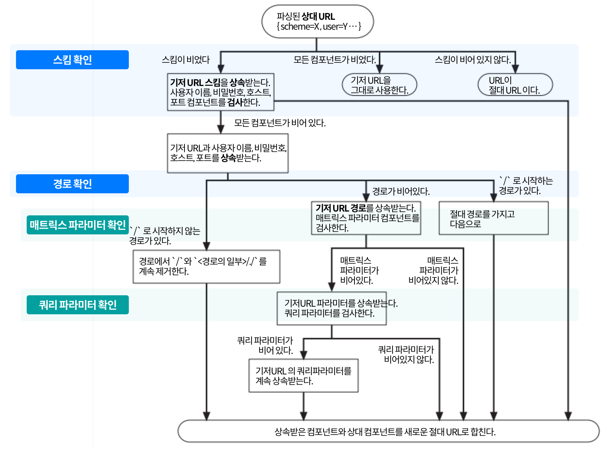
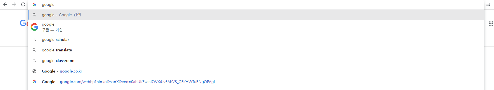

### 2.1 인터넷의 리소스 탐색하기

URL을 통해 인터넷 리소스에 접근한다.  
한 URL을 예로보면,  
http://www.joes-hardware.com/seasonal/index-fall.html  
첫번째로 { http: } 이부분이 스킴(어떻게) 이다. 스킴을 통해 프로토콜을 명시한다. 
두번째로 { www.joes-hardware.com/ } 이부분이 호스트(어디에) 이다. 리소스가 있는 서버를 명시한다.  
세번째로 { seasonal/index-fall.html } 경로(무엇을) 이다. 서버내에 있는 리소스를 명시한다.

### 2.2 URL 문법
대부분의 URL 스킴의 문법은 9개 부분으로 나뉜다. 즉 스킴마다 문법이 달라질 수 있다.  
<스킴>://<사용자이름>:<비밀번호>@<호스트>:<포트>/<경로>;<파라미터>?<질의>#<프래그먼트>  
이 모든 컴포넌트를 가지는 URL은 거의 없다. 가장 중요한 스킴, 호스트, 경로 3개는 확실하게 기억해두자.

| 컴포넌트                                                                                                    | 설명                                                                                                                           | 기본값        |
|:--------------------------------------------------------------------------------------------------------|:-----------------------------------------------------------------------------------------------------------------------------|:-----------|
| 스킴                                                                                                      | 리소스에 접근하기 위한 프로토콜을 가리킨다.                                                                                                     | 없음         |
| 사용자 이름 &nbsp;&nbsp;&nbsp;&nbsp;&nbsp;&nbsp;&nbsp;&nbsp;&nbsp;&nbsp; | 몇몇 스킴은 리소스에 접근을 하기 위해 사용자 이름을 필요로 한다.                                                                                        | anonymous  |
| 비밀번호                                                                                                    | 사용자의 비밀번호를 가리키며, 사용자 이름에 콜론(:)으로 이어서 기술한다.                                                                                   | <이메일주소>    |
| 호스트                                                                                                     | 리소스를 호스팅하는 서버의 호스트 명이나 IP 주소.                                                                                                | 없음         |
| 포트                                                                                                      | 리소스를 호스팅하는 서버가 열어놓은 포트번호. 여러 스킴들이 기본 포트를 갖고있다.                                                                               | 스킴에따라 다름 &nbsp;&nbsp;&nbsp;&nbsp;&nbsp;&nbsp;&nbsp;&nbsp;&nbsp;&nbsp;&nbsp;&nbsp;&nbsp;&nbsp;&nbsp;  |
| 경로                                                                                                      | 이전 컴포넌트와 슬래쉬(/)로 구분되어 있으며, 서버내 리소스가 서버 어디에   있는지를 가리킨다. 경로 컴포넌트의 문법은 서버와 스킴에 따라 다르다.                                         | 없음         |
| 파라미터                                                                                                    | 특정 스킴들에서 입력 파라미터를 기술하는 용도로 사용한다. 파라미터는  이름/값을 쌍으로 가진다. 파라미터는 다른 파라미터나 경로의 일부와 세미콜론(;)으로 구분하여 기술하며, 여러 개를 가질 수 있다.            | 없음         |
| 질의                                                                                                      | 스킴에서 애플리케이션에 파라미터를 전달하는데 쓰인다. 질의 컴포넌트를  작성하는데 쓰이는 공통포맷은 없다. URL 끝에 물음표(?)로 구분한다.                                             | 없음         |
| 프래그먼트                                                                                                   | 리소스의 조각이나 일부분을 가리키는 이름이다. URL이 특정 객체를 가리킬 경우에  프래그먼트 필드는 서버에 전달되지 않는다. 클라이언트에서만 사용되며, URL  끝에서 샵(#) 문자로 구분한다.                | 없음         |

### 2.3 단축 URL
크게 상대URL과 URL확장 의 합쳐진 개념이다.
#### 2.3.1 상대URL 
baseURL을 이용하여 URL을 짧게 표기하는 방식이다. baseURL 은 현재 클라이언트가 접근중인 URL 이다.  
예를 들어 클라이언트 http://www.joes-hardware.com/tools.html 이라는 URL로 접근하여 화면을 보고있다. tools.html 의 내용은 다음과 같다.  
```html
<HTML>
<head>
<title>this Tools</title>
</head>
<BODY>
<p>more product mosigi .. <a href="./hammers.html"/></p>
</BODY>
</HTML>
```
이때 기저URL은 http://www.joes-hardware.com/ 이다.  
상대URL은 a태그 안에 href 속성의 값인 "./hammers.html" 이다.  
이 둘이 합쳐져서 http://www.joes-hardware.com/hammers.html 이 된다.  
상대URL이 절대URL이 되는 과정은 다음과 같다.
  

#### 2.3.2 URL확장  
브라우저의 URL 입력란에 google 이라고 적으면 해당 문자열을 포함한 완성된 URL 들을 보여준다. 그 중에 클라이언트는 선택만 하면된다.  
그림에 나온 기능이 URL 확장이다.

